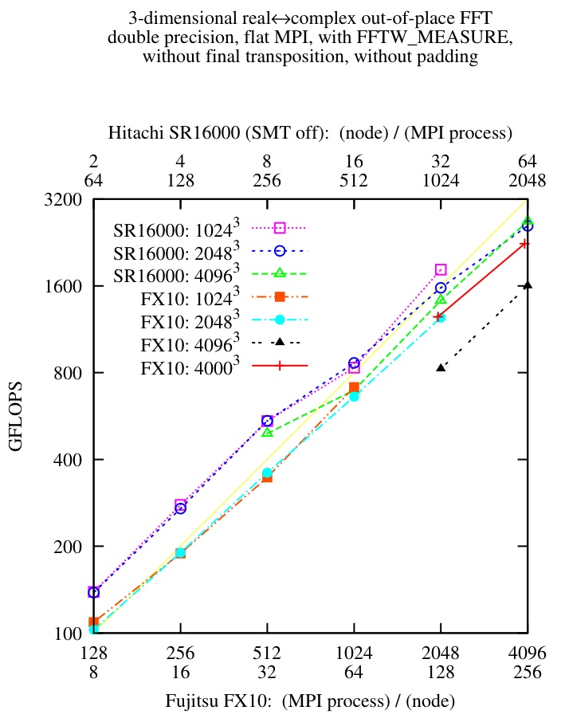

fft_check_mpi.F, a 3-dimensional FFT benchmark program written in Fortran with MPI
==================================================================================
fft_check_mpi.F is a benchmark program. It times in-place and
out-of-place double-precision real 3-dimensional FFT.
It is written in Fortran, using FFTW, parallelized with MPI.

Homepage and download
---------------------
<https://github.com/t-nissie/fft_check_mpi>

FFTW
----
It is very important that machines have the *de facto standard* and
*ultra fast* FFT library, FFTW <http://www.fftw.org/> .

See also:
* <http://www.fftw.org/doc/Transposed-distributions.html>
* <http://www.fftw.org/doc/Combining-MPI-and-Threads.html>

How to build fft_check_mpi
--------------------------
There are makefiles for some machines such as SR16000, FX10, etc.
Flat MPI and OpenMP+MPI hybrid parallelization versions of makefiles
are provided in flatMPI/ and hybrid/ directories.

    $ cd flatMPI; make -f Makefile.FX10-mpifrtpx
    $ cd hybrid;  make -f Makefile.SR16000-xlf90_r-fftw_xlc

How to execute fft_check_mpi
----------------------------
fft_check_mpi requires five command line arguments.
They are the number of iterations, Lx, Ly, Lz and
in-place (in) or out-of-place (out). For example,

    $ mpirun -np 8 ./fft_check_mpi 100 512 512 512 out

output, timing and GFLOPS
-------------------------
fft_check_mpi writes results into standard output (stdout).
A result contains Lx, Ly, Lz, N(=LxLyLz), in-place or out-of-place,
the number of OpenMP threads, the number of MPI processes, time for plan,
time for preparation, time for dummy loops, time for calculation,
and GFLOPS value.

Data for debug will be written into standard error output (stderr).

Giga FLOPS values are roughly estimated from 5N*log_2(N)/2 floating point operations.

Benchmark results
-----------------

Flat MPI vs. OpenMP+MPI hybrid parallelization
----------------------------------------------
fft_check_mpi.F can be compiled both in flat MPI and in OpenMP+MPI
hybrid parallelization. In many cases of large scale 3-dimensional FFT,
flat MPI is more efficient than hybrid parallelization.

Table I. Performance measurements of 10243 3-dimentional FFT on FX10.
The number of nodes, parallelization method, time for one FFT and IFFT, GFLOPS value
and efficiency are listed.

       1 node  OpenMP    9260   ms     17.4 GFLOPS   7.4% (measured with fft_check.F)
      64 node  flat MPI   225   ms    714.9 GFLOPS   4.7%
    1024 node  hybrid      36.9 ms   4368.7 GFLOPS   1.8% (FFTW_PATIENT)

Table II. 12003 FFT on FX10.

       1 node  OpenMP   12170   ms     21.8 GFLOPS   9.2% (measured with fft_check.F)
      75 node  flat MPI   335   ms    791.7 GFLOPS   4.5%
    1200 node  hybrid      58.0 ms   4570.9 GFLOPS   1.6% (FFTW_PATIENT)

Table III. 14403 FFT on FX10.

       1 node  OpenMP     ???   ms     ??.? GFLOPS   ?.?% (requires 50GB of memory)
      90 node  flat MPI   489   ms    960.7 GFLOPS   4.5%
    1440 node  hybrid      89.9 ms   5224.8 GFLOPS   1.5% (FFTW_PATIENT)

Padding
-------
If the numbers of dimensions of an array are powers of two,
for example r(2048,2048,2048), "bank conflict" may occur in FFT and
it reduces computational speed. To avoid "bank conflict",
"padding" is commonly introduced, for example r(2048,2048+3,2048).
However, introduction of "padding" make code complicated.
Therefore, "padding" is not introduced in this fft_check_mpi.F.

Compare 40963 and 40003 results of FX10 in the figure.

Initial dummy loops
-------------------
On some platforms, initial loops takes unpredictable time.
Therefore, fft_check_mpi.F wast 5 dummy loops in the beginning.

See "TLB miss" in <http://en.wikipedia.org/wiki/Translation_lookaside_buffer>.

fft_check, a benchmark program for single node
----------------------------------------------
You can find a benchmark program for single node at
<http://loto.sourceforge.net/feram/src/fft_check.html>.
fft_check is parallelized only with OpenMP.

Copying and author
------------------
Copyright © 2012-2013 by Takeshi Nishimatsu

fft_check_mpi is distributed in the hope that
it will be useful, but WITHOUT ANY WARRANTY.
You can copy, modify and redistribute fft_check_mpi,
but only under the conditions described in
the GNU General Public License (the "GPL").

Takeshi Nishimatsu (t-nissie{at}imr.tohoku.ac.jp)
